# How a Tiny AI Learned to Check Its Own Work

**TL;DR:** A 1.5B parameter model improved from 58% to 65% on a coding benchmark by learning to verify its own outputs. The insight: verification is an underexplored axis of improvement, orthogonal to scale.

---

## The Problem

Today's AI strategy is simple: make models bigger. Each generation costs more to train, more to run, and concentrates power in fewer hands.

But there's a deeper problem: **AI models are confidently wrong.** They generate plausible-sounding code that doesn't run, plausible-sounding math that doesn't add up, plausible-sounding facts that aren't true. Scale helps, but it doesn't fix this.

What if there's another way?

---

## The Core Insight

**Verification is cheaper than scale.**

Instead of making the model bigger, give it a fact-checker. Let it generate many attempts, test them, and learn which ones work.

```mermaid
flowchart LR
    subgraph NC["THE NEURAL COMPUTER"]
        G["🔧 GENERATOR<br/><i>Proposes code</i>"]
        E["⚡ EXECUTOR<br/><i>Runs tests</i>"]
        C["🎯 CRITIC<br/><i>Learns to predict</i>"]

        G -->|"candidates"| E
        E -->|"pass/fail labels"| C
        C -->|"feedback"| G
    end

    style G fill:#e1f5fe
    style E fill:#fff3e0
    style C fill:#e8f5e9
```

**Generator**: A small coding model (Qwen 1.5B). Proposes candidate solutions.

**Executor**: A Python sandbox. Runs code against unit tests. Provides ground truth.

**Critic**: A neural network trained on execution results. Learns to predict "will this code pass?" without running it.

The key: we train the Critic on *verified outcomes*, not text patterns. It learns what correct code looks like, not just what plausible code looks like.

---

## The Results

We tested on MBPP (Mostly Basic Python Programming) — 500 coding problems, standard benchmark.

| Setup | MBPP Score | What It Means |
|-------|------------|---------------|
| Base Qwen 1.5B | 58.4% | Just generate once, take what you get |
| + GRPO (RL) | 60.7% | Model improves from its own verified outputs |
| **+ GRPO + Critic** | **65.0%** | Generate 50, Critic picks the best |
| Oracle | 90.7% | If we could perfectly pick from 50 attempts |

The system improves the baseline by **+6.6 percentage points** — recovering about 20% of the gap to the oracle upper bound.

---

## Why This Works

The Critic is trained on *execution labels*, not human preferences or text similarity. When code passes tests, that's a hard fact. The Critic learns to internalize what "passing code" looks like.

The Generator doesn't need to be perfect. It just needs to be *good enough* that some of its attempts are correct. The Critic does the rest.

---

## Why This Matters

### 1. Verification is a General Principle

Code has tests. Math has symbolic checkers. Logic has proof assistants. Science has simulations.

Anywhere you can automatically verify answers, you can build a Neural Computer. The Generator proposes, the Executor verifies, the Critic learns.

### 2. Small Models Can Improve Themselves

A 1.5B model improved by 6.6 points just by learning to verify its outputs. This matters for:

- **Cost**: No need to train a bigger model. Same weights, smarter selection.
- **Privacy**: Small models can run locally, keeping data on-device.
- **Autonomy**: The system generates its own training signal from execution.

### 3. Self-Improvement Works (With Guardrails)

The model improved itself by learning from its own verified outputs. But the keyword is *verified* — the Executor provides ground truth. Without that anchor, self-improvement risks amplifying errors.

---

## The Broader Picture

Scale is one axis of improvement. Verification is another.

The lesson: **verification is a real axis of improvement**, orthogonal to scale.

A small model can meaningfully improve itself using only execution feedback — no human labels, no distillation from a larger model. The gap to the oracle (91%) suggests there's much more to recover.

---

## What's Next

The oracle upper bound (91%) is far above our current result (65%). That gap is the opportunity.

- **Better critics**: The current critic recovers ~20% of the oracle gap. Can we do better?
- **Scale up**: Apply this to 7B/70B models — do they have higher oracles?
- **Tighter loops**: Verify at finer granularity (line-by-line, not just whole programs)
- **Math reasoning**: Use symbolic checkers as oracles (GSM8K, MATH)

---

*For technical details, see [PAPER_STATUS.md](./PAPER_STATUS.md).*
